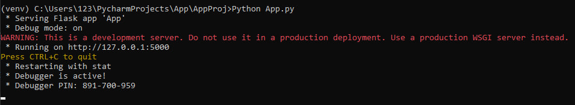
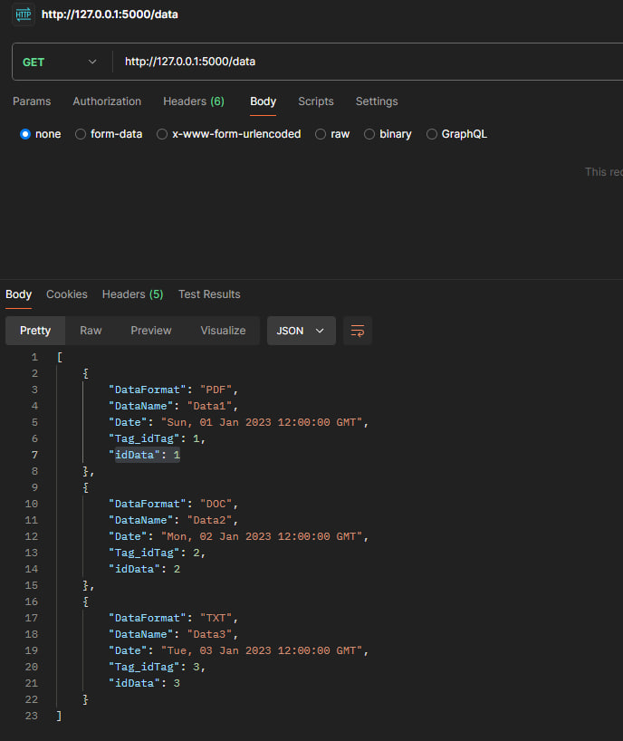
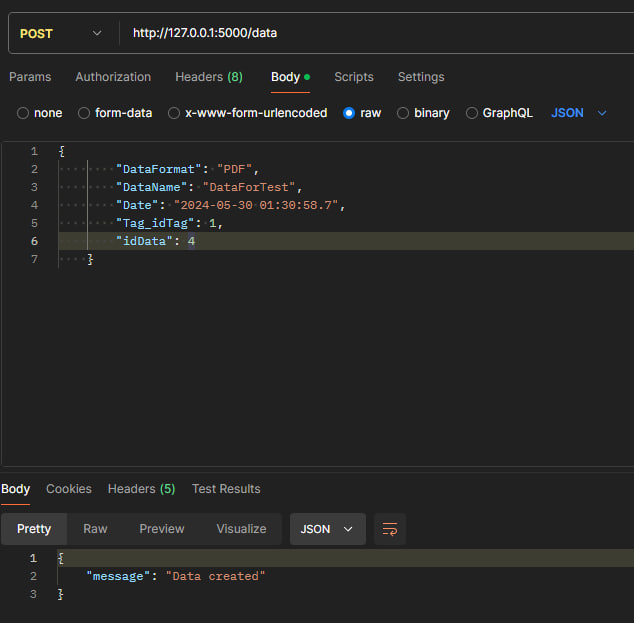
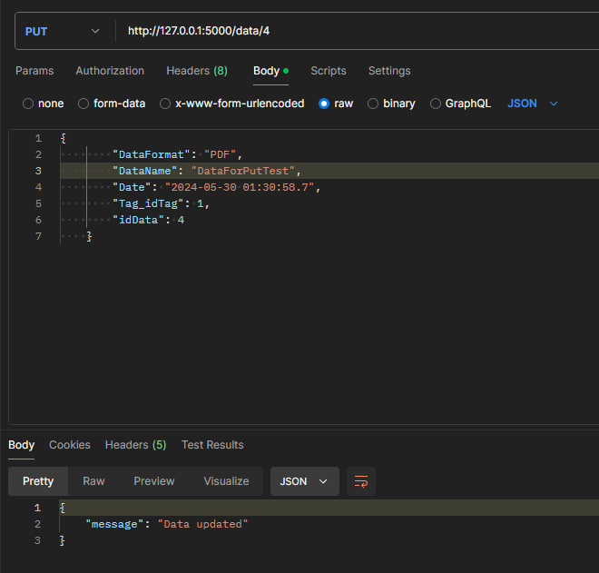
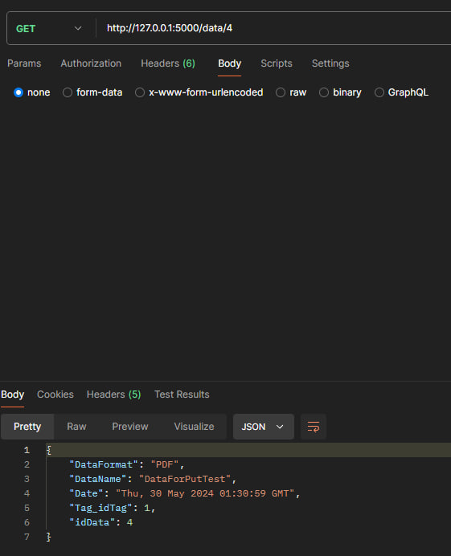
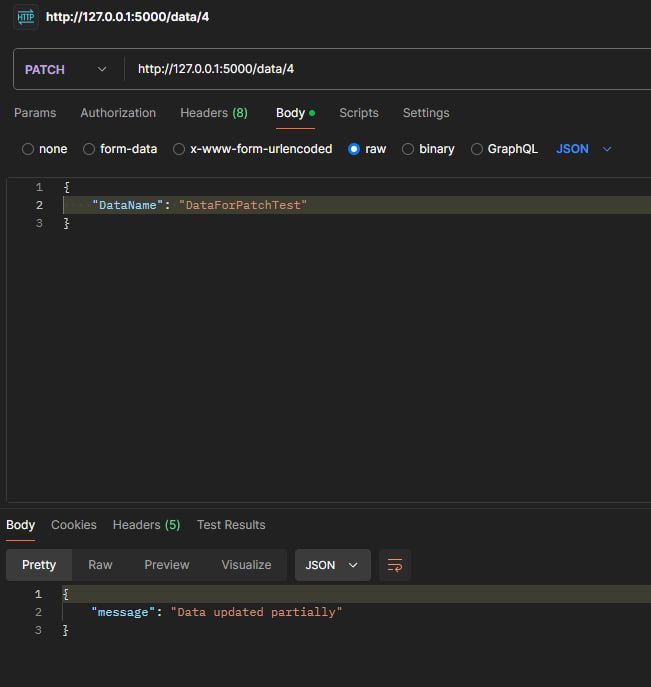
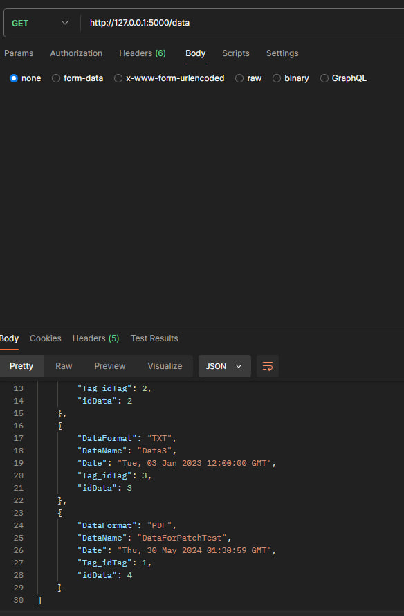
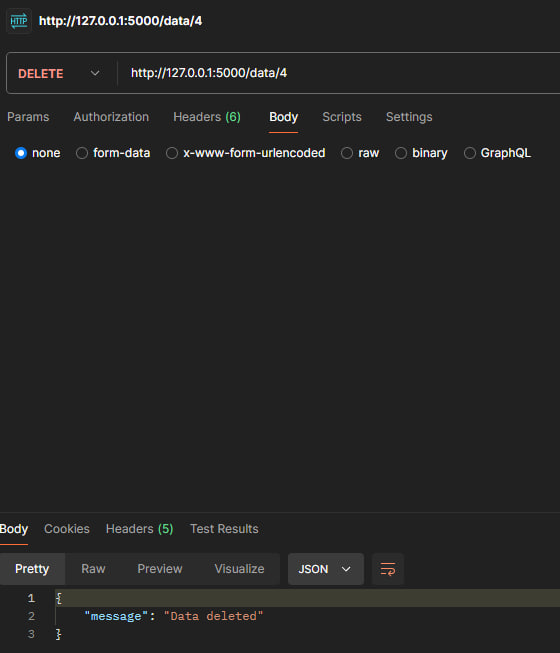

# Тестування працездатності системи
Для тестування системи використовувся додаток Postman
## Запуск сервера

 
## Метод GET(all)

 
## Метод POST

## Метод PUT

### Перевірка за допомогою GET

 
 ## Метод PATCH

 
### Перевірка за допомогою GET

  ## Метод DELETE

 
### Перевірка за допомогою GET

